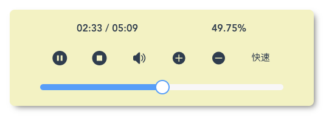
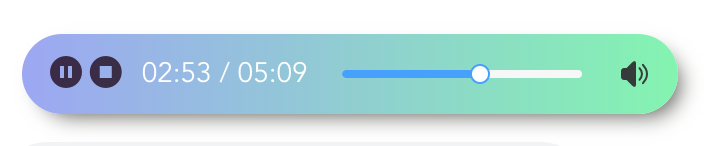

# vue-audio-better

[](https://www.npmjs.com/package/vue-audio-better) [](https://vuejs.org/)

> Easy to create custom audio player components for Vue.js.

> 一个有灵魂的进度条。

> A progress bar with soul.

> 简单、有趣的 audio 组件，非常感谢您的 star!

> Simple, fun audio components, Thank you for your star!

## Overview

### Normal



### Mini



## Installation

```bash
npm install vue-audio-better --save
```

## Update

Add a mini audio component.

## Setup

### Bundler (Webpack, Rollup)

```js
// in your entrypoint
import Vue from 'vue'
import VueAudio from 'vue-audio-better'

Vue.use(VueAudio)
```

## Usage

### Required Markup

```vue

  <vue-audio
    audio-source="https://example.com/example.mp3"
  ></vue-audio>

```

```vue

  <mini-audio
    audio-source="https://example.com/example.mp3"
  ></mini-audio>

```

## Props

### `width`

Type: `Number` - Default: `500`

Audio width

### `audio-source`

Type: `String` - Required

A string of audio file URL

### `html5`

Type: `Boolean` - Default: `false`

Whether to force HTML5 Audio

### `loop`

Type: `Boolean` - Default: `false`

Whether to start the playback again
automatically after it is done playing

### `preload`

Type: `Boolean` - Default: `true`

Whether to start downloading the audio
file when the component is mounted

### `autoplay`

Type: `Boolean` - Default: `false`

Whether to start the playback
when the component is mounted

### `formats`

Type: `String[]` - Default: `[]`

Howler.js automatically detects your file format from the extension,
but you may also specify a format in situations where extraction won't work
(such as with a SoundCloud stream)

### `xhrWithCredentials`

Type: `Boolean` - Default: `false`

Whether to enable the `withCredentials` flag on XHR requests
used to fetch audio files when using Web Audio API ([see reference](https://developer.mozilla.org/en-US/docs/Web/API/XMLHttpRequest/withCredentials))

## Data

### `playing`

Type: `Boolean`

Whether audio is currently playing

### `muted`

Type: `Boolean`

Whether the audio playback is muted

### `volume`

Type: `Number`

The volume of the playback on a scale of `0` to `1`

### `rate`

Type: `Number`

The rate (speed) of the playback on a scale of `0.5` to `4`

### `seek`

Type: `Number`

The position of the playback in seconds

### `duration`

Type: `Number`

The duration of the audio in seconds

### `progress`

Type: `Number`

The progress of the playback on a scale of `0` to `1`

## Methods

### `play()`

Start the playback

### `pause()`

Pause the playback

### `togglePlayback()`

Toggle playing or pausing the playback

### `stop()`

Stop the playback (also resets the `seek` to `0`)

### `mute()`

Mute the playback

### `unmute()`

Unmute the playback

### `toggleMute()`

Toggle muting and unmuting the playback

### `setVolume(volume)`

Set the volume of the playback (value is clamped between `0` and `1`)

### `setRate(rate)`

Set the rate (speed) of the playback (value is clamped between `0.5` and `4`)

### `setSeek(seek)`

Set the position of the playback (value is clamped between `0` and `duration`)

### `setProgress(progress)`

Set the progress of the playback (value is clamped between `0` and `1`)

## Development

### Build

Bundle the js to the `dist` folder:

```bash
npm run build
```

## Acknowledgements

[howler.js](https://github.com/goldfire/howler.js)
[vue-howler](https://github.com/mickdekkers/vue-howler)

## License

[MIT](http://opensource.org/licenses/MIT)
